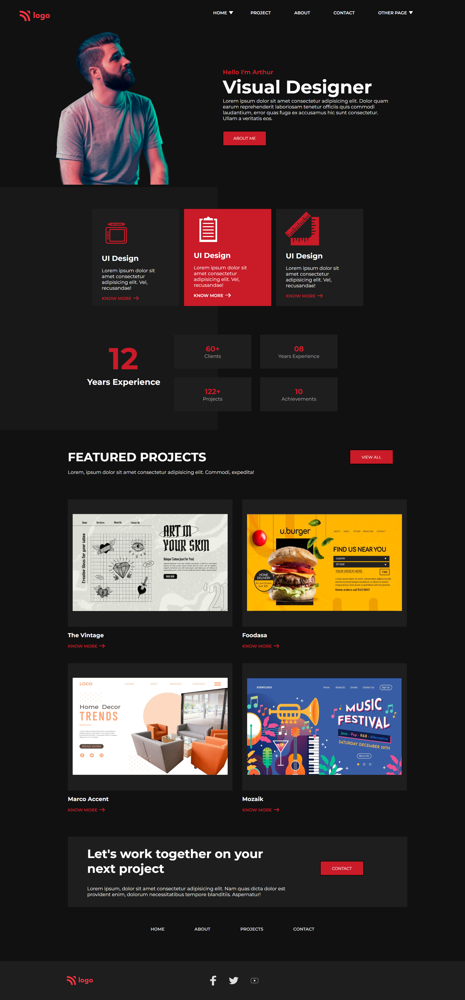

# Description
This is a sample page. The website focuses on implementing the basics of HTML and CSS to create this amazing static webpage.

## Time taken

12hours and 30 mins(including responsiveness, code cleanup and development)

## Things Learned

- More on Relative units
- More Responsive layouts
- More Making shapes using CSS

### The deployed Version Link

[Product Designer Landing Page](https://productdesignlp.netlify.app/)

### SnapShot of the Webpage

